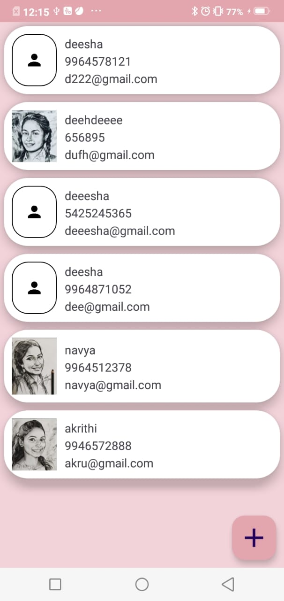

# Contacts Manager App

A simple Android application to manage contacts, developed as a learning project to explore the concept of **Room Database** in Android development. The app demonstrates Create, Read, Update, Delete operations using modern Android Architecture Components like **ViewModel**, **LiveData**, and **RecyclerView**.

## Features
- **Add New Contacts**
- **View Saved Contacts**
- **Edit Contacts**
- **Delete Contacts**
- **Data Persistence**

  
  
  
  
  

